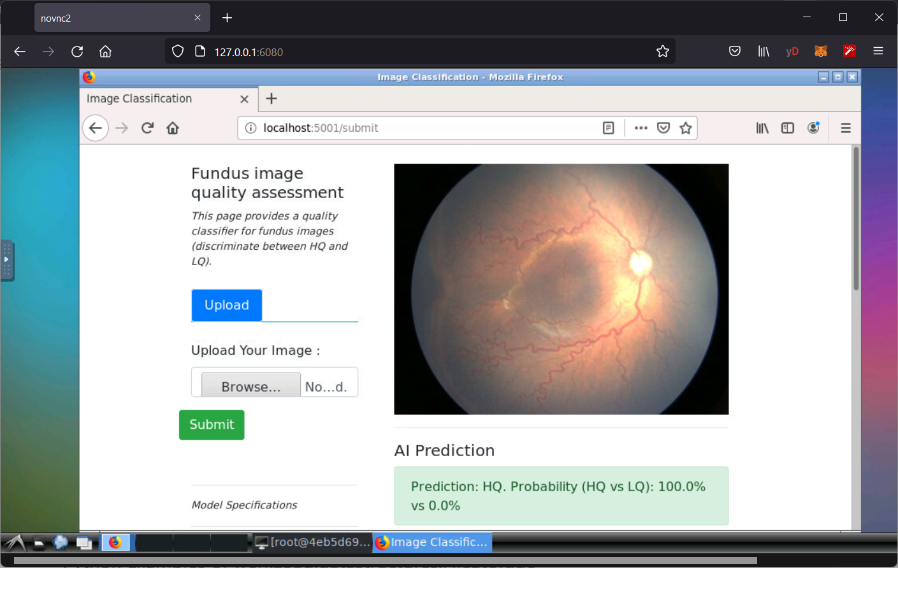
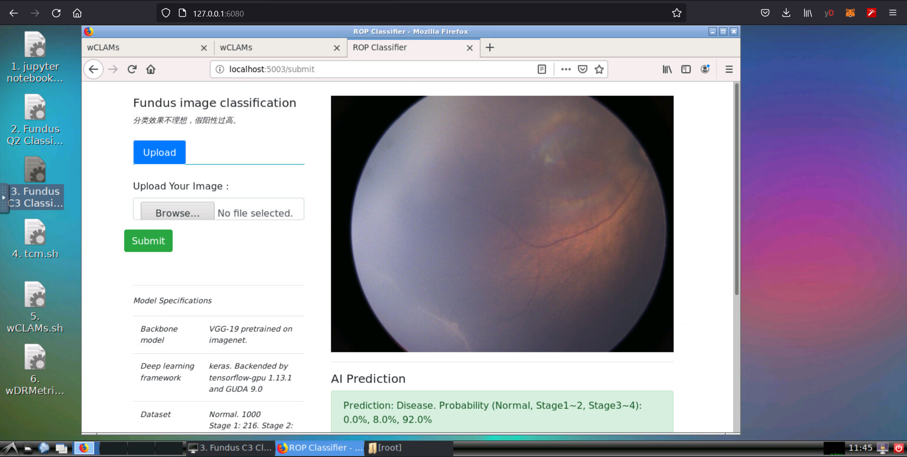
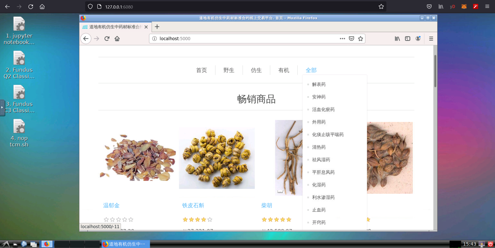
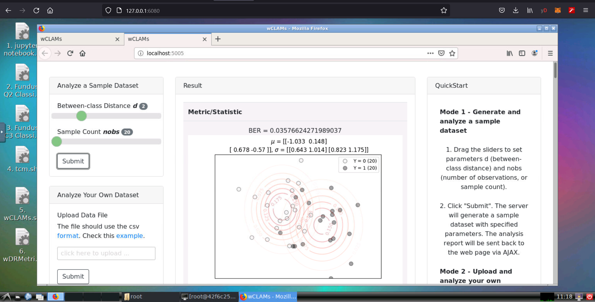
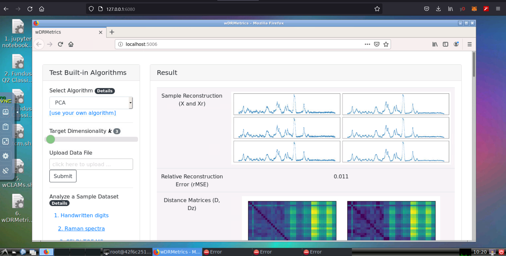
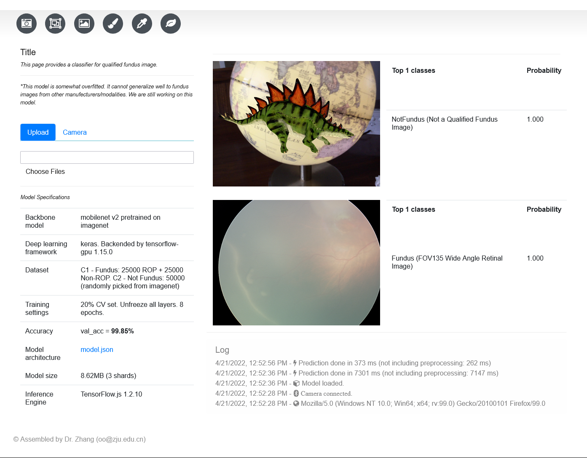

# Abstract

This is a self-developed docker image to provide a common env for new tech research (e.g., AI, deep learning, data science, block chain, etc.).

Features of image:
1. GUI in browser (powered by dorowu/ubuntu-desktop-lxde-vnc)
2. jupyter notebook with auto-sklearn
3. flask-based AI apps
4. dotnet-based apps

# Quickstart

Install docker. On linux or raspbian,   
`curl -fsSL https://get.docker.com -o get-docker.sh`   
`sudo sh get-docker.sh`

`docker pull zhangyinsheng/ai:latest`

`docker run --name ubvnc -v %cd%:/host/ -p 5900:5900 -p 6080:80 -p 8888:8888 zhangyinsheng/ai:latest`

# Build

The building process of this image is painful (due to many version conflicts and package incompatible issues). I wrote down the full process for future reference.

## Pull the base image 

> docker pull dorowu/ubuntu-desktop-lxde-vnc:bionic

Other Ubuntu flavors are available by the tags:

    focal: Ubuntu 20.04 (latest)
    focal-lxqt: Ubuntu 20.04 LXQt
    bionic: Ubuntu 18.04
    bionic-lxqt: Ubuntu 18.04 LXQt

After download, create a container to test the image: 

> docker run --name ubvnc -p 6080:80 -p 5900:5900 dorowu/ubuntu-desktop-lxde-vnc:bionic

Then you can access http://127.0.0.1:6080/ in web browser. A vnc remote desktop should show up.

## Install Fundamental Packages

Open a terminal inside the vnc desktop or directly launch the CLI from the docker container.

Then run the following commands:

> bash

> apt update 

    You may also use apt-get, but generally the apt tool is favored. apt merges functionalities of apt-get and apt-cache

> apt install python3-pip build-essential swig python3-dev git nano gedit python-is-python3 lsb-core wget

> apt install libjpeg-dev zlib1g-dev 
 
    pillow / PIL needs these two packages

> apt install lsof

    We will use lsof to kill processes by the port number.

copy the app startup scripts (*.sh) to the container's desktop, e.g., use the /host shared dir.

## APP1: autosklearn

> pip3 install tensorflow==1.14.0 -i https://pypi.tuna.tsinghua.edu.cn/simple

> pip3 install keras==2.3.1

> pip3 install h5py==2.10.0 --force-reinstall

    tf 1.X, keras 2.3.1 and h5py 2.10.0 have better compatibility. Newer versions will raise error for legacy py codes.

> pip3 install auto-sklearn 

    for poor network, use: pip3 install --upgrade --default-timeout=100000 auto-sklearn

> pip3 install pillow  -i https://pypi.tuna.tsinghua.edu.cn/simple

    During the installation, lazy_import may raise exception. Use the following solution:

> git clone --recurse-submodules http://github.com/mnmelo/lazy_import.git

> cd lazy_import

> nano setup.py # modify the code to skip reading README.rst

> pip install -e .

Test the autosklearn can be imported properly.

> python3
  >> import autosklearn

## APP2: Q2_Flask

Copy app codes to the container

> docker cp "host_path_to\Q2_Flask" ubvnc:/root/

## APP3: C3_Flask

Copy app codes to the container

> docker cp "host_path_to\C3_Flask" ubvnc:/root/

## APP4: nop-tcm 

Install dotnet and dependencies

Check linux distribution and version:

> lsb_release -a

    LSB Version:    core-9.20170808ubuntu1-noarch:security-9.20170808ubuntu1-noarch
    Distributor ID: Ubuntu
    Description:    Ubuntu 18.04.3 LTS
    Release:        18.04
    Codename:       bionic

Install dotnet runtime:

> wget https://packages.microsoft.com/config/ubuntu/18.04/packages-microsoft-prod.deb -O packages-microsoft-prod.deb

> dpkg -i packages-microsoft-prod.deb

> apt update

> apt install -y aspnetcore-runtime-6.0 # or dotnet-sdk-6.0

> dotnet --list-runtimes

    Microsoft.AspNetCore.App 6.0.4 [/usr/share/dotnet/shared/Microsoft.AspNetCore.App]
    Microsoft.NETCore.App 6.0.4 [/usr/share/dotnet/shared/Microsoft.NETCore.App]

> apt install runit-systemd

后续mysql / postgresql需要systemd。systemd是一个全新的init系统和系统管理器，兼容传统的基于SysV init系统的所有主要的Linux发行版。 systemd兼容SysV和LSB init脚本，它作为SysV init系统的直接替代品。 systemd是内核启动并保持PID 1的第一个进程，它是系统运行后的所有进程的的父进程

----
Install Postgres

> apt install postgresql postgresql-contrib

> service --status-all
    [ ? ]  alsa-utils
    [ - ]  cron
    [ - ]  dbus
    [ ? ]  hwclock.sh
    [ ? ]  kmod
    [ + ]  nginx
    [ - ]  postgresql
    [ - ]  procps
    [ + ]  supervisor
    [ - ]  sysstat
    [ - ]  x11-common

> service postgresql restart
 * Restarting PostgreSQL 10 database server

> su - postgres

> psql

    psql (10.19 (Ubuntu 10.19-0ubuntu0.18.04.1))

> \conninfo

    You are connected to database "postgres" as user "postgres" via socket in "/var/run/postgresql" at port "5432".

> ALTER USER postgres WITH PASSWORD 'postgres'; # NOTE the semicolon

    Set password

> CREATE EXTENSION citext;

    To avoid the "λ:FluentMigrator.Runner.IVersionLoader" error.

> \du
    
    postgres  | Superuser, Create role, Create DB, Replication, Bypass RLS | {}

> \l
> 
    List of databases
    nop       | postgres | UTF8     | C.UTF-8 | C.UTF-8 | 

> \q

    quit

> psql nop postgres 

    re-login to nop db with user postgres

-----
(Alternative) If you don't use postgre, install mssql (much larger):

> add-apt-repository "$(wget -qO- https://packages.microsoft.com/config/ubuntu/18.04/mssql-server-2019.list)"

> apt update

> apt install mssql-server

> /opt/mssql/bin/mssql-conf setup

    Choose an edition of SQL Server:
    1) Evaluation (free, no production use rights, 180-day limit)
    2) Developer (free, no production use rights)
    3) Express (free)
    4) Web (PAID)
    5) Standard (PAID)
    6) Enterprise (PAID) - CPU Core utilization restricted to 20 physical/40 hyperthreaded
    7) Enterprise Core (PAID) - CPU Core utilization up to Operating System Maximum
    8) I bought a license through a retail sales channel and have a product key to enter.

    Enter your edition(1-8): 3

------
Copy the nop folder to /var/www/nop

> cd /var/www/nop

> dotnet --fx-version 6.0.4 Nop.Web.dll

Open http://localhost:5000

Initial Installation Error:

    The 'ff821abb5f08\root' account is not granted with Modify permission on folder '/var/www/nop/bin'. Please configure these permissions.
    The 'ff821abb5f08\root' account is not granted with Modify permission on folder '/var/www/nop/logs'. Please configure these permissions.

Solution: 

    Create the '/var/www/nop/bin' and '/var/www/nop/logs' folders and set permissions.

## App5: wCLAMs

> apt install r-base r-base-dev wget libffi-dev

> pip3 install tqdm rpy2==3.3 cffi==1.14.1 pyCLAMs wCLAMs 

Launch R and run `install.packages("ECoL")`

## App6: wDRMetrics

> pip3 install pyDRMetrics wDRMetrics

## App7: tfjs-app

> pip3 install tfjsa

## Publish to Docker Hub

> docker commit ubvnc zhangyinsheng/ai:latest

> docker push zhangyinsheng/ai:latest

# Run

> docker run --name ubvnc -v %cd%:/host/ -p 5900:5900 -p 6080:80 -p 8888:8888 zhangyinsheng/ai:latest

On Linux host, should change `%cd%` to `$(pwd)`  
`-v %cd%:/host/` links host home to the container, for file access and sharing convenience.

Once inside the vnc desktop, you will see these sh files:

1. jupyter notebook with autosklearrn support.sh 

    This will start up a jupyter notebook on port 8888. The default work dir is /root. autosklearn is supported.

2. Fundus Q2 Classifier.sh

    This will start up a web based fundus image qualifier on port 5002:
    
    This app judges whether an image is a qualified fundus image. This easy classification task has an accuracy of nearly 100%. 
    The app needs the model weight file to run. [Download Url](https://www.aliyundrive.com/s/ke4sLop3jRK) 
    
3. Fundus C3 Classifier.sh

    This will start up a web based fundus image classification on port 5003:
    
    This is a three-class classification task (normal, stage1-2, stage 3-4). The model's accuracy is about 88.8%. We are still working on this model to improve its performance.
    The app needs the model weight file to run. [Download Url](https://www.aliyundrive.com/s/ke4sLop3jRK) 

4. tcm.sh

    This is an online TCM trading demo app based on nop commerce.
    

5. wCLAMs.sh

    See https://github.com/zhangys11/wCLAMs
    

6. wDRMetrics.sh

    See https://github.com/zhangys11/wDRMetrics
    

7. tfjsa.sh

    See https://github.com/zhangys11/tfjs-app
    

8. Users may implement and deploy their own apps by reusing this docker image. For flask-based app, refer to Q2, C3, wCLAMs and wDRMetrics. For dotnet-based app, refer to nop-tcm.

