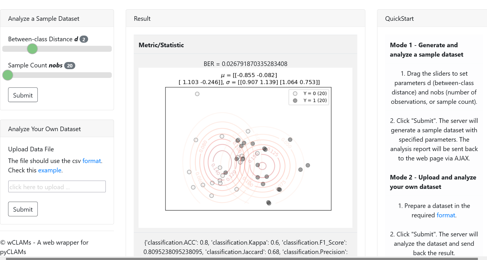

# About

This project is a GUI wrapper for pyCLAMs (https://github.com/zhangys11/pyCLAMs).  
Developed by Dr. Zhang (oo@zju.edu.cn).   

# How to use

1. cd wCLAMs
2. python wCLAMs.py
3. Go to http://0.0.0.0:5005/